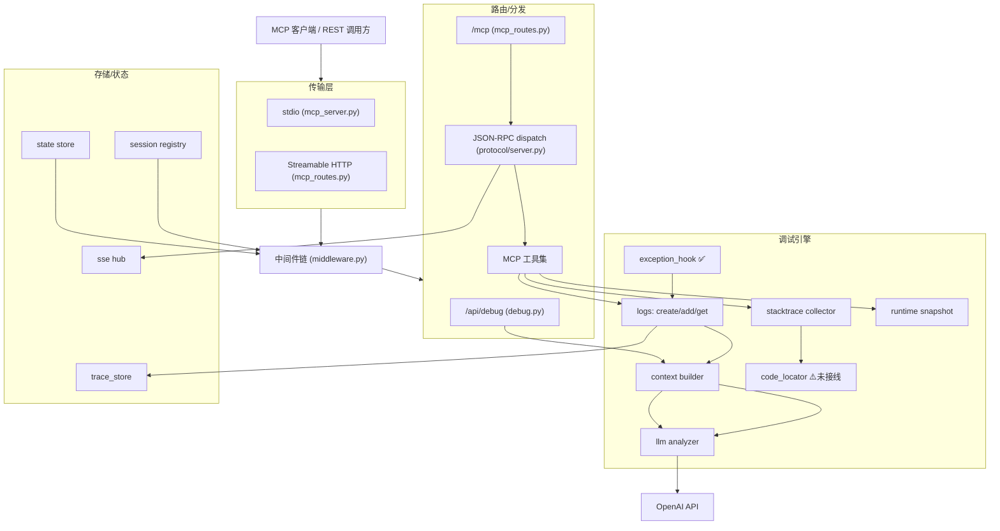
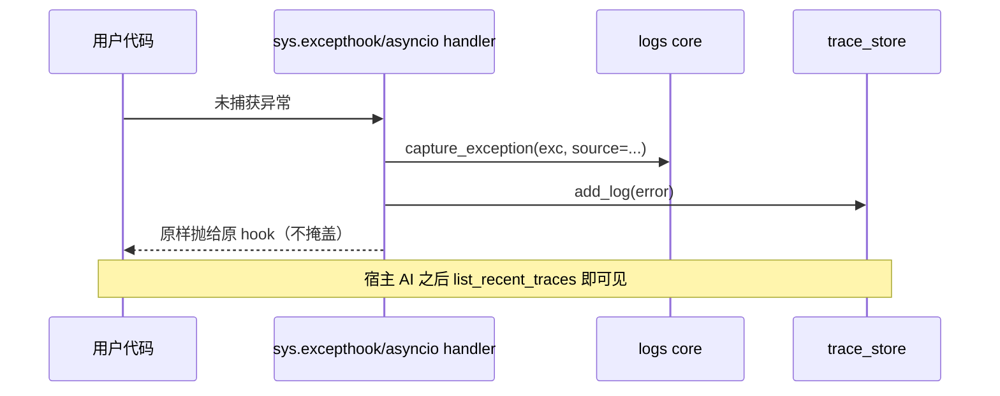
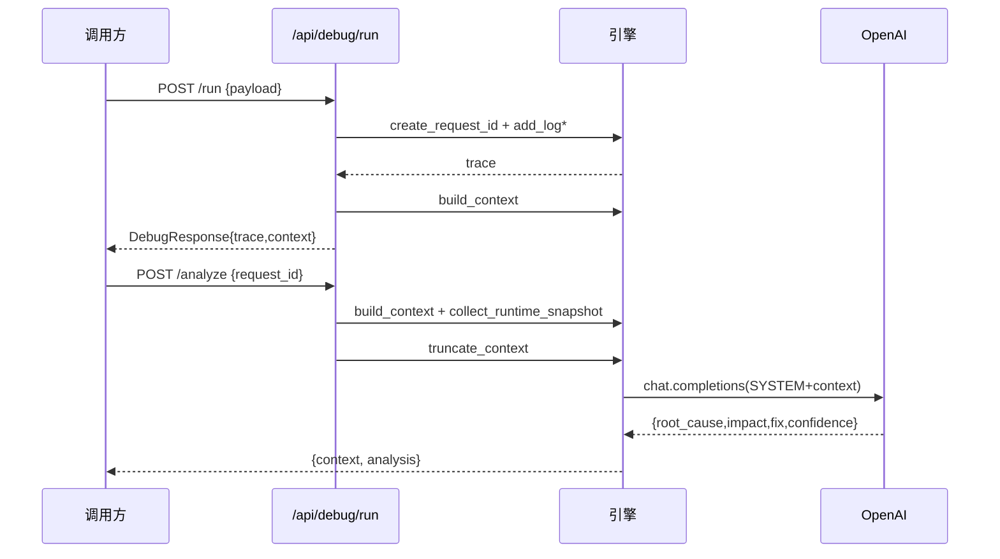
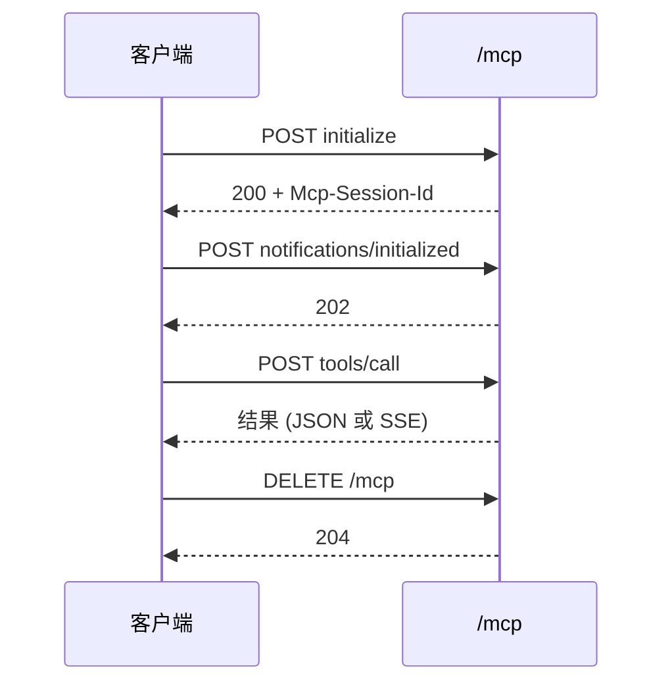

# ai-debug-mcp 技术设计文档（DESIGN）

> 本文档描述 ai-debug-mcp 的**实现设计**：系统架构、模块职责、关键流程、数据模型、接口契约、设计决策与待设计项。
> 配套文档：产品需求文档 `PRD.md`（回答"做什么/为什么"），本文档回答"怎么做"。
> 版本：v0.2.0｜设计状态：✅ 已落地 / ⚠️ 已写待补完 / 🔲 设计草案（待实现）
> 审阅视角：高级工程师 / 高级架构师

---

## 1. 设计目标与原则

| 目标 | 设计落点 |
| --- | --- |
| 把运行时数据转为 AI 可消费的结构化上下文 | Trace Log → Context Builder → LLM/宿主 AI |
| 零手工整理（不手写提示词） | **宿主 AI 推理模式**：服务只交付结构化原始数据，推理交给 Trae/Codex/Claude |
| 不漏掉未处理异常 | `exception_hook` 全局捕获（sync + asyncio） |
| 安全可部署 | fail-closed 鉴权 + 限流 + 流式请求体限制 + 安全头 |
| 双形态接入 | Streamable HTTP（远程）+ stdio（本地子进程），共用同一份业务逻辑 |
| 可降级 | 快照采集/LLM 故障不阻断主流程 |

---

## 2. 系统架构

### 2.1 分层架构

```
┌─────────────────────────────────────────────────────────────┐
│  客户端层                                                     │
│  MCP 客户端 (Trae/Codex/Claude Desktop) │ REST 调用方 │ 浏览器 │
└───────────────┬───────────────────────────┬─────────────────┘
                │ JSON-RPC 2.0               │ HTTP/JSON
        ┌───────▼────────┐          ┌─────────▼──────────┐
        │ 传输层          │          │ 传输层              │
        │ stdio 子进程    │          │ Streamable HTTP     │
        │ (mcp_server.py) │          │ POST/GET(SSE)/DELETE│
        └───────┬────────┘          │ (/mcp, mcp_routes)  │
                │                   └─────────┬──────────┘
                └───────────────┬──────────────┘
                                ▼
┌─────────────────────────────────────────────────────────────┐
│ 中间件层 (middleware.py)                                      │
│ Auth → MaxBodySize → RateLimit → SecurityHeaders → Trace      │
└───────────────────────────────┬─────────────────────────────┘
                                ▼
┌─────────────────────────────────────────────────────────────┐
│ 路由/分发层                                                   │
│ /api/debug/* (debug.py) │ /mcp (mcp_routes.py) │ /health /metrics │
│ JSON-RPC 分发 (protocol/server.py → dispatch_raw)            │
└───────────────────────────────┬─────────────────────────────┘
                                ▼
┌─────────────────────────────────────────────────────────────┐
│ 调试引擎 (Engine)                                             │
│ logs(trace) │ context builder │ stacktrace │ code_locator⚠️  │
│ runtime snapshot │ llm analyzer │ exception_hook            │
└───────────────────────────────┬─────────────────────────────┘
                                ▼
┌─────────────────────────────────────────────────────────────┐
│ 存储/状态 (Storage)                                           │
│ trace_store(memory/pg) │ session registry │ state store(memory/redis) │
│ sse hub (广播) │ specs 🔲(FR15)                              │
└───────────────────────────────┬─────────────────────────────┘
                                ▼
                          OpenAI API
```

### 2.2 组件关系图（Mermaid）



---

## 3. 模块设计

### 3.1 传输层

#### 3.1.1 Streamable HTTP（`app/api/mcp_routes.py`）✅

实现 MCP Streamable HTTP 规范，单路由 `/mcp` 支持三种方法：

| 方法 | 行为 | 关键逻辑 |
| --- | --- | --- |
| `POST /mcp` | 收 JSON-RPC（initialize/tools/list/tools/call/通知） | 预解析 JSON 取 `method`/`id`/`Mcp-Session-Id`；`initialize` 时 `registry.create()` 下发 `Mcp-Session-Id`；非 initialize 无有效会话 → 400；分发 `dispatch_raw(raw)`；按 `Accept` 决定返回 JSON 或 SSE |
| `GET /mcp` | SSE 推送通道 / 健康检查 | `Accept: text/event-stream` 且会话有效 → 订阅 `hub.subscribe(session_id)` 长连推送；否则返回 `_health_payload()` |
| `DELETE /mcp` | 终止会话 | `registry.delete(session_id)` → 204 |

**会话模型**：`Mcp-Session-Id` 头贯穿；`registry.mark_initialized()` 标记初始化完成；未初始化访问 `tools/*` 被拒（400）。定时清理 TTL=1800s（`main.py` lifespan）。

**SSE 广播**：`app/mcp/transports/sse.py` 的 `hub` 提供 `subscribe/format_event/unsubscribe`，用于服务端→客户端主动推送。

#### 3.1.2 stdio（`app/mcp_server.py` + `app/mcp/transports/stdio.py`）✅

- `mcp_server.py`：标准 MCP Server，用 `mcp` SDK 的 `stdio_server` 通信，`list_tools()` 注册 **6 个工具**，`call_tool()` 分发。
- 注册方式：客户端配置 `{"command":"python","args":["-m","app.mcp_server"],"cwd":"<abs>"}`。
- `--stdio` 入口：`python -m app.main --stdio`（`main.py` `__main__`）。

**6 个 stdio 工具**：

| 工具 | 说明 | 实现 |
| --- | --- | --- |
| `get_stacktrace` | 最近/指定异常堆栈（文件/行/函数） | `tool_get_stacktrace` |
| `get_runtime_snapshot` | CPU/内存/线程/Python 版本 | `tool_get_runtime_snapshot` |
| `search_logs` | 按关键字+时间窗搜历史 trace | `tool_search_logs` |
| `get_debug_context` | **核心**：trace+runtime+（文档承诺含源码片段⚠️实际未含） | `tool_get_debug_context` |
| `list_recent_traces` | 最近错误摘要列表 | `tool_list_recent_traces` |
| `analyze_with_llm` | 可选：内置 LLM 分析（一般不用） | `tool_analyze_with_llm` |

#### 3.1.3 双传输一致性

两套传输（HTTP 工具 `debug/context/trace/stacktrace` 与 stdio 6 工具）**共用** `app/mcp/core/logs`、`builders`、`collectors`、`llm` 业务逻辑，差异仅在协议外壳。

### 3.2 中间件层（`app/middleware.py`）✅

注册顺序（外→内）：`CORS → Auth → MaxBodySize → RateLimit → SecurityHeaders → Trace`。

| 中间件 | 机制 | 设计要点 |
| --- | --- | --- |
| `AuthMiddleware` | Bearer / X-API-Key；`hmac.compare_digest` 恒定时间比较；`PUBLIC_PATHS=(/,/health,/metrics)` | **fail-closed**：无 Key 且 `api_key` 已设 → 401；未设 `api_key` 则整体禁用（启动告警） |
| `MaxBodySizeMiddleware` | 先查 `Content-Length` 硬拒；POST/PUT/PATCH **流式分块读取**，超 `max_body_size` 立即 413，避免整 body 进内存 | 防 DoS/OOM |
| `RateLimitMiddleware` | `state_store.allow("ratelimit:{ip}", per_minute, 60)`；异常降级放行 | 按客户端 IP |
| `SecurityHeadersMiddleware` | 补 `X-Content-Type-Options`/`X-Frame-Options`/`Referrer-Policy`/`X-XSS-Protection` | — |
| `TraceMiddleware` | 注入 `trace_id` → `X-Trace-Id`/`X-Response-Time`；异常记录 `trace_id` | 请求级可观测 |

### 3.3 路由/分发层

#### 3.3.1 REST 调试 API（`app/api/debug.py`）✅

| 端点 | 逻辑 |
| --- | --- |
| `POST /api/debug/run` | `create_request_id` → `add_log(request_start/processing/response_ready)` → `build_context` → 出错则 `capture_exception` 挂 `context["exception"]` → `DebugResponse` |
| `POST /api/debug/analyze` | `get_logs`→404 校验→`build_context`→`collect_runtime_snapshot`(失败降级)→`analyze()`；LLM 失败 502 |
| `POST /api/debug/analyze/stream` | 同上，SSE `data:{chunk}` / `[DONE]` |
| `GET /api/debug/runtime` | `collect_runtime_snapshot()` |
| `GET /api/debug/session` | `session_manager.list_active()` 含 idle 时长 |

#### 3.3.2 JSON-RPC 分发（`app/mcp/protocol/server.py` + `jsonrpc.py`）✅

`dispatch_raw(raw)` 解析 JSON-RPC 2.0，按 `method` 路由到工具 `handler`；`make_error(id, code, msg)` 统一错误；`PROTOCOL_VERSION`/`CAPABILITIES` 声明能力。错误不回显内部堆栈（仅"见服务端日志"）。

### 3.4 调试引擎

#### 3.4.1 Trace Log 管理（`app/mcp/core/logs.py`）✅

- `create_request_id()` → 唯一 ID。
- `add_log(request_id, step, data)` → 时序追加，步骤含 `request_start`/`processing`/`response_ready`/`error` 及 MCP 专用 `mcp_*`。
- `get_logs(request_id)` → 按序取回。
- 持久化由 `trace_store` 后端（`memory`/`postgresql`）承担；TTL 清理（`main.py` `periodic_cleanup`，300s 周期）。

#### 3.4.2 Context Builder（`app/mcp/builders/context.py`）✅

`build_context(request_id, logs)` → `{request_id, flow, input, output, errors}`。单条格式异常 `try/except` 标记为 `<malformed>` 并跳过，**不阻断整体**。

> ⚠️ 注意：此构建器**不含 `code_snippets`**。要落实 P1，需在此或 `get_debug_context` 中调用 `code_locator.get_snippets_for_frames()`（见 §6 待设计）。

#### 3.4.3 Stacktrace Collector（`app/mcp/collectors/stacktrace.py`）✅

`capture_exception(exc)` → `{type, message, traceback, frames[], frame_count}`；每帧 `{file, line, function, code, locals}`。`format_trace_for_ai()` 生成精简文本（含局部变量前 N 个）。

#### 3.4.4 Code Locator（`app/mcp/collectors/code_locator.py`）⚠️ 已实现模块，未接线+配置缺失

- `get_code_snippet(file, line, context_lines)`：用 `linecache` 读取 `line±context_lines` 行，报错行以 `>>> N: ` 标注；文件读不到返回 `found=False`。
- `get_snippets_for_frames(frames)`：批量处理堆栈帧。
- **缺陷（需修）**：第 15 行 `settings.code_context_lines` 在 `config.py` 中**不存在** → 不传 `context_lines` 时 `AttributeError`。`schemas/context.py` 的 `DebugContext.code_snippets` 字段已定义但未在任何工具输出中被填充。

#### 3.4.5 Runtime Snapshot（`app/mcp/collectors/runtime.py`）✅

`collect_runtime_snapshot()`（psutil）→ `RuntimeSnapshot{pid, cpu_percent, memory_mb, thread_count, open_files, python_version, env_hint}`。失败降级（不抛未捕获异常）。

#### 3.4.6 LLM Analyzer（`app/llm/analyzer.py`）✅

- `SYSTEM_PROMPT`：要求模型输出 JSON `{root_cause, impact, fix, confidence}`。
- `build_analysis_prompt(context)`：把 context 拼为文本（调试/展示用）。
- `truncate_context(context, max_tokens)`：运行时快照/异常帧/整体按字符数（`max_tokens*3`）截断，超长标记 `_truncated`。
- `_retry_call(...)`：重试（`llm_max_retries`）+ 指数退避 + 限流/超时处理；耗尽切换到 `llm_fallback_model`（缩短 prompt 重试 1 次）；仍失败抛 `RuntimeError`。
- `analyze(context)` / `analyze_stream(context)`：非流式/流式；流式用 SSE 逐块 yield。

#### 3.4.7 全局异常钩子（`app/mcp/hooks/exception_hook.py`）✅

`install_global_hook()`（幂等）：
- 覆盖 `sys.excepthook` → 未捕获同步异常自动 `capture_exception(exc, source="global_hook")`。
- 覆盖 asyncio loop `set_exception_handler` → 未 await 的协程异常同样捕获。
- FastAPI 请求内异常由 `middleware`/路由层单独捕获（Starlette 会吞部分异常）。
- 捕获逻辑自身 `try/except` 包裹，绝不掩盖原始报错。

> 价值：直接消解用户"手动查日志"负担——任何未处理异常自动入库，宿主 AI 用 `list_recent_traces` 即可见。

### 3.5 存储/状态层

| 组件 | 职责 | 实现 |
| --- | --- | --- |
| `trace_store` | trace/session 持久化 | `memory` / `postgresql`（工厂 `storage/factory.py`） |
| `session registry` | MCP `Mcp-Session-Id` 会话生命周期 | `transports/session.py`，TTL 1800s |
| `state store` | 限流/计数 | `memory` / `redis` |
| `sse hub` | 服务端→客户端广播 | `transports/sse.py` |
| `specs` 🔲 | 规范存储（FR15） | 待设计 |

### 3.6 可观测性（`app/observability.py`）✅

`/metrics`（Prometheus 文本）、`/health`（校验 LLM 配置 + 存储层连通性，状态 `ok/degraded/unhealthy`）、启动日志打印关键配置。

### 3.7 配置（`app/config.py`，pydantic-settings）✅

单例 `settings`，读 `.env`。**已知缺口**：缺 `code_context_lines` 键（§6.1）。

---

## 4. 关键流程时序

### 4.1 全局异常自动捕获（✅ 已落地）



### 4.2 调试流程 + LLM 分析（✅）



### 4.3 MCP Streamable HTTP 握手（✅）



---

## 5. 数据模型（`app/schemas`）

```python
# TraceEntry: {step, data, ts}
# DebugContext: {trace, runtime?, code_snippets:[CodeSnippet], note}
# CodeSnippet: {file, error_line, snippet, found}
# RuntimeSnapshot: {pid, cpu_percent, memory_mb, thread_count, open_files, python_version, env_hint}
# Session: {session_id, created_at, last_active, metadata}
```

LLM 输出契约：`{root_cause:str, impact:str, fix:str, confidence:"high|medium|low"}`。

---

## 6. 待设计 / 缺口（架构师提出，待实现）

### 6.0 迁移增量（参考项目迁移，M1–M8 已完成）✅

下表能力已按 proj1 架构重新实现并通过单测（55 用例），**未复制 proj2 文件、未改存储抽象/中间件/协议/传输**：

| 模块 | 文件 | 说明 |
| --- | --- | --- |
| 脱敏 | `app/mcp/core/redaction.py` | 存储边界统一脱敏，默认开启 |
| 统一存取 | `app/mcp/core/trace_repo.py` | 在 TraceStorage + errors 之上实现 save_trace/get_trace/save_network_record/save_ui_event 等 |
| 网络采集 | `app/mcp/collectors/network.py` + `tools/network_api.py` | 解析/截断 + ingest_network/get_network_trace |
| UI 采集 | `app/mcp/collectors/ui_event.py` | 解析/截断 |
| Git 归因 | `app/mcp/core/git.py` + `tools/git_api.py` | blame/diff，带超时+路径白名单 |
| 静默失败 | `app/mcp/tools/silent_failure_api.py` + `api/ingest.py` | 编排 ui/network + trace_kind |
| 跨语言上报 | `app/mcp/tools/ingest_api.py` + `api/ingest.py` | ingest_error |
| inbound 采集 | `app/middleware_network.py` | 独立中间件，默认关闭，安全栈内层 |
| 完整上下文 | `app/mcp/builders/context.py::build_debug_context` | 注入 code/git/network/ui/runtime/related_specs |
| 规范驱动采集 | `app/mcp/collectors/spec.py` + `tools/spec_api.py` | 扫描/标签匹配/缓存/脱敏 + get_related_specs |
| 指纹去重聚合 | `app/mcp/core/errors.py` | compute_fingerprint + occurrence_count，避免重复刷屏 |
| 双传输注册 | `tools/__init__.py` + `mcp_server.py` | HTTP 11 工具 / stdio 13 工具 |

> **仍待建**：Playwright 自动遍历（FR14）、`assert_behavior` 自动断言 + `verify` 工具（FR13 自动检测 / FR15 持续校验）、`specs` 存储 CRUD。proj2 的 tenacity/浏览器SDK 评估为不适用，未迁移。

### 6.1 FR11 代码定位接线（✅ 已实现，v0.2.1）

**原问题**：`code_locator` 已写但 (a) `get_debug_context` 未调用它，(b) `config.py` 缺 `code_context_lines`。

**已落地改动**：
1. `config.py` 增加 `code_context_lines: int = 5` + `source_path_map` / `ide_scheme` / `whitelist_path_prefix`。
2. `code_locator.py` 生成 `vscode://file/<abs>:<lineno>` 链接，支持路径映射与白名单防穿越；`CodeSnippet` 增加 `link` 字段。
3. `stacktrace_api` / `context_api` / `debug.py` 在异常含帧时附加 `code_snippets`。
4. 新建 `app/mcp/core/errors.py`（线程安全双端队列）存储近期捕获异常；`exception_hook` 真正持久化（此前丢弃返回值）。
5. 修复 `mcp_server.py` 的 `tool_*` 导入 bug，`get_debug_context`/`get_runtime_snapshot`/`analyze_with_llm`/`list_recent_traces`/`search_logs`/`get_stacktrace` 现已全部可用。

**验证**：编译通过 + 导入测试通过 + 功能测试（`get_code_snippet` 对本仓库文件产出带 `>>>` 标记片段与 `vscode://` 链接）。

### 6.2 FR13 静默失败检测（⚠️ 采集链已实现 M6，自动检测待建）

**组件**：`app/mcp/verifier/assert_engine.py`
- `Spec` 模型：`{kind:api|ui|rule, target, expect:{status?, body_rules?, state_change?}}`。
- `assert_behavior(actual, spec) -> {matched:bool, diffs:[{field, expected, actual}]}`。
- 判定：当 `matched==False` 且 `status` 非 4xx/5xx 且无异常 → 产出 `SilentFailure{type, target, expected, observed, likely_cause}`。
- `likely_cause` 由 LLM 基于 `diffs + context` 推断（复用 `analyzer`）。

### 6.3 FR14 前端自动化验证（🔲 P1，设计草案）

**组件**：`app/verifier/ui_runner.py`（可选依赖 `playwright`）
- 输入规范：`{page_url, interactions:[{action:click|type|navigate, selector, expect:{state_change?|no_response?}}]}`。
- 执行：启动 headless Chromium，按规范遍历；`无响应且无报错` → `silent_failure(type=ui_no_response)`。
- 复用 FR13 断言引擎，保证前后端口径一致。
- 可降级：未装 Playwright 或元素未找到 → 跳过并告警，不阻断。

### 6.4 FR15 规范驱动闭环（⚠️ 采集+注入已实现 M9，verify/持续校验待建）

**组件**：`app/mcp/core/spec_store.py`（memory/pg 同 trace_store 工厂）
- 新增 MCP 工具 `spec`(get/set/list)、`verify`(按规范校验 request/interaction)。
- 统一诊断输出（新增字段）：`{errors[], silent_failures[], code_locations[], spec_diffs[], analysis}`。
- 持续校验模式：每次请求先套规范断言，再（可选）异常检测，合并为 `diagnosis`。

---

## 7. 关键设计决策（ADR 摘要）

| 决策 | 选择 | 理由 |
| --- | --- | --- |
| 宿主 AI 推理 vs 内置分析 | **默认宿主 AI 推理**，`analyze_with_llm` 仅可选 | 避免重复推理与花费；服务专注"采集+结构化" |
| 协议 | MCP（JSON-RPC 2.0）+ Streamable HTTP/stdio | 标准、被主流客户端原生支持 |
| 上下文截断 | 字符估算（`max_tokens*3`）+ 帧/局部变量上限 | 控成本与延迟，防超长 |
| 安全默认 | fail-closed + 恒定时间比较 | 防未授权与时序攻击 |
| 降级 | 快照/LLM 失败不阻断主流程 | 提高可用性 |
| 存储 | 工厂模式 memory/pg + 状态 memory/redis | 本地轻量 / 生产持久 |

---

## 8. 部署与配置

- 启动：`uvicorn app.main:app --host 0.0.0.0 --port 8000`（或 `python -m app.main --stdio`）。
- 依赖：`requirements.txt`（fastapi、uvicorn、openai、psutil、psycopg2、redis、mcp、pydantic-settings）。
- 关键配置：见 `PRD.md` §11.3；**务必生产设 `API_KEY` 与 `CORS_ORIGINS`**；`code_context_lines` 待补（§6.1）。
- 容器化：`Dockerfile` + `docker-compose.yaml` 已提供。

---

## 9. 安全设计

- 传输：HTTPS 由前置代理提供；CORS `*` 时强制 `allow_credentials=False`。
- 鉴权：API Key，fail-closed，恒定时间比较，公钥路径免鉴权。
- 防 DoS：流式请求体限制（内存恒定 ≤ `max_body_size`）、按 IP 限流。
- 信息脱敏：内部异常/DB 错误不回显；`/health` 仅状态不泄露细节。
- 密钥：`.env` 不入库，提供 `.env.example` + `.gitignore`。
- 路径安全（待补）：`file://`/`vscode://` 仅限 `WHITELIST_PATH_PREFIX`，防目录穿越。

---

## 10. 风险与开放问题

| 项 | 说明 | 处置 |
| --- | --- | --- |
| 代码定位未接线 | `get_debug_context` 实际不含片段，文档与代码不一致 | §6.1 P0 修复 |
| 配置键缺失 | `code_context_lines` 不存在 | §6.1 |
| 静默失败/前端自动化未建 | P5 采集链已就绪（M6）；P4 自动遍历(FR14)/P6 自动断言(FR13)/spec(FR15) 仍待建 | §6.2–6.4 设计草案 |
| 厂商锁定 | 仅 OpenAI | 路线图多厂商抽象 |
| memory 后端 | 重启即丢 | 生产用 postgresql |

---

## 附录：模块 ↔ 文件 速查

| 模块 | 文件 |
| --- | --- |
| 入口/生命周期 | `app/main.py` |
| 中间件 | `app/middleware.py` |
| REST 调试 | `app/api/debug.py` |
| HTTP MCP | `app/api/mcp_routes.py` |
| stdio MCP | `app/mcp_server.py` |
| JSON-RPC | `app/mcp/protocol/{server,jsonrpc}.py` |
| Trace | `app/mcp/core/logs.py` |
| Context | `app/mcp/builders/context.py` |
| Stacktrace | `app/mcp/collectors/stacktrace.py` |
| Code Locator | `app/mcp/collectors/code_locator.py` ⚠️ |
| Runtime | `app/mcp/collectors/runtime.py` |
| LLM | `app/llm/analyzer.py` |
| 异常钩子 | `app/mcp/hooks/exception_hook.py` ✅ |
| 存储 | `app/mcp/core/storage/*` |
| 会话/SSE | `app/mcp/transports/{session,sse}.py` |
| 可观测 | `app/observability.py` |
| 配置 | `app/config.py` |
