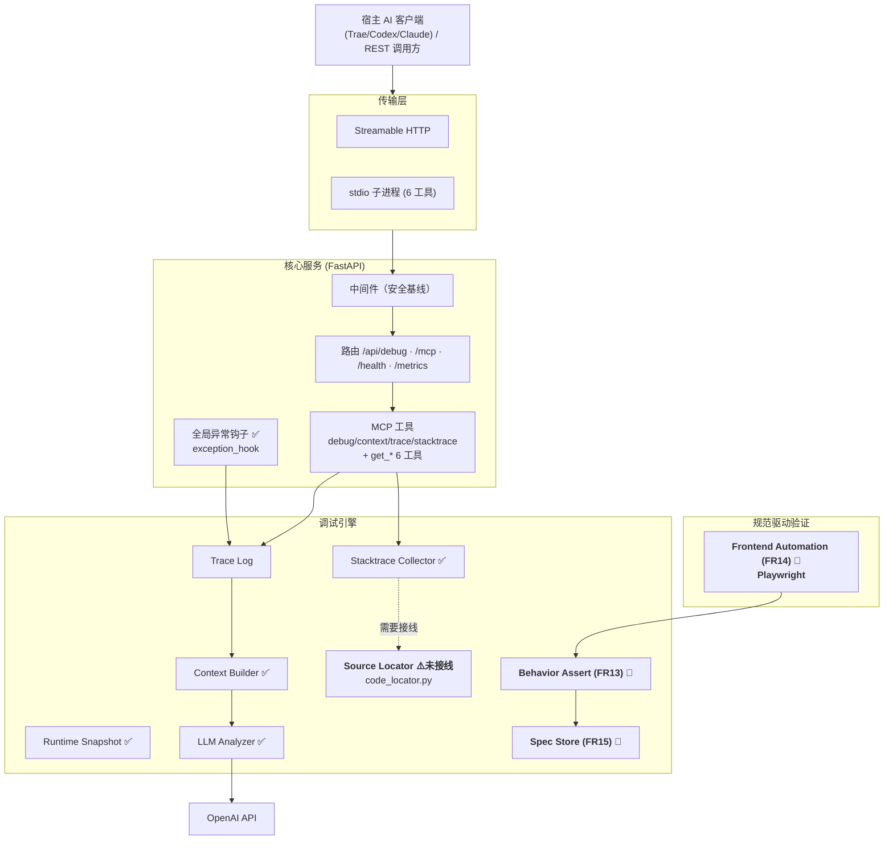
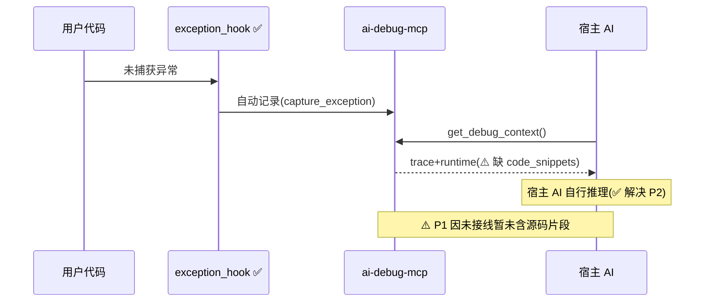
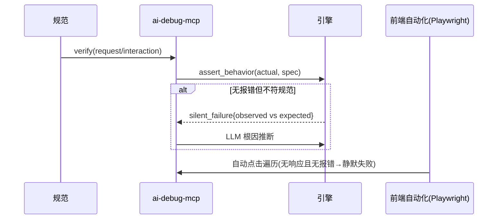

# ai-debug-mcp 产品需求文档（PRD）

> 基于 MCP（Model Context Protocol）协议的 AI 智能调试服务
> 核心目标：**把开发者从「查日志 → 翻代码 → 手写规范提示词 → 丢给 AI → 反复排查」的繁琐链路中解放，并解决「无报错但功能不对」的静默失败问题。**

| 项目 | 说明 |
| --- | --- |
| 文档版本 | v3.0（架构师核实版） |
| 产品名称 | ai-debug-mcp |
| 当前产品版本 | v0.2.0 |
| 文档状态 | 草案（Draft，已标注真实实现状态） |
| 创建日期 | 2026-07-07 |
| 最后更新 | 2026-07-07 |
| 负责人 | AI 调试平台团队 |
| 审阅视角 | 高级工程师 / 高级架构师（代码核实） |

---

## 1. 修订记录

| 版本 | 日期 | 修订人 | 修订说明 |
| --- | --- | --- | --- |
| v1.0 | 2026-07-07 | 团队 | 首版 PRD |
| v2.0 | 2026-07-07 | 团队 | 以真实痛点重构，新增 FR11–FR15 |
| v3.0 | 2026-07-07 | 高级架构师 | **代码核实后修正实现状态**：标注自动捕获/宿主AI推理已落地；代码定位标记为"模块已实现但未接线+配置缺失"；静默失败/前端自动化确认为待开发；补充架构师痛点覆盖度矩阵与落地缺口 |

---

## 2. 问题陈述与用户痛点（核心）

> 本章是文档灵魂，所有需求均围绕解决以下真实开发场景。后期开发以本章为验收出发点。

### 2.1 场景一：报错后的「找文件 + 写规范」时间黑洞

**用户原话**：写代码报错，查日志再丢给 AI，时间在找代码文件、以及书写规范的提示词里。

| 子痛点 | 表现 | 传统损耗 |
| --- | --- | --- |
| P1 找代码文件 | 堆栈只有相对路径+行号，需自行翻找 | 每次 5–15 分钟 |
| P2 手写规范提示词 | 日志原始噪声大，需手动整理成角色+上下文+期望格式 | 重复劳动、格式不统一 |
| P3 上下文割裂 | 日志/代码/运行时分散，手动对齐 | AI 分析质量不稳 |

### 2.2 场景二：规范驱动开发中「无报错但功能不对」的静默失败

**用户原话**：不能一个个点前端 UI；有些点了没反应、又没代码错误；AI 说语法没问题、API 无报错，但实际上存在问题。

| 子痛点 | 表现 | 为何现有工具查不出 |
| --- | --- | --- |
| P4 前端交互手工遍历繁琐 | 需人工逐个点击验证 | 调试工具只覆盖后端，不覆盖前端交互 |
| P5 点击无反应（静默失败） | 按钮无反应，控制台/后端均无报错 | 无异常抛出 = 堆栈捕获失效 |
| P6 「AI 说没问题但实则有问题」 | 语法对、接口 200，但行为不符规范 | 缺"期望规范"基准，AI 只能判"有无错误" |

**本质**：当前排障范式是"有异常才调试"，而真实问题大量是"无异常但行为偏离规范"。需把**规范（Spec）作为一等公民**。

---

## 3. 架构师核实：当前实现已覆盖 / 未覆盖的能力

> 本节直接回答「读 PRD 能否解决痛点」。结论：**已实现约 60%**，其余为真实待开发项。

### 3.1 已落地（代码核实 ✅）

| 能力 | 代码证据 | 对应痛点 |
| --- | --- | --- |
| **全局异常自动捕获** | `app/mcp/hooks/exception_hook.py`：`install_global_hook()` 覆盖 `sys.excepthook` + asyncio handler，未捕获异常自动记录 | 消解 P3「手动查日志」 |
| **结构化上下文直达宿主 AI** | `mcp_server.py` 设计原则：服务只交付原始结构化数据，**宿主 AI（Trae/Codex/Claude）自行推理**，避免重复调用；`get_debug_context` 打包 trace+runtime | 消解 P2「手写规范提示词」（设计上由宿主 AI 承担推理） |
| **代码定位模块（源码片段读取）** | `app/mcp/collectors/code_locator.py`：`get_code_snippet` 用 `linecache` 读取报错行附近源码并 `>>> 行号` 标注；`schemas/context.py` 的 `DebugContext` 含 `code_snippets` 字段 | P1 的"读取源码"部分已实现 |
| **LLM 分析 + 截断 + 重试 + fallback + 流式** | `app/llm/analyzer.py` | 辅助 P2 |
| **安全中间件 / 可观测性 / 双传输 / 配置管理** | 见 v1.0 | 基础设施 |

### 3.2 已写但未真正跑通（⚠️ 缺陷，需补完才能解决痛点）

| 能力 | 问题（架构师发现） | 影响 |
| --- | --- | --- |
| **代码定位接入工具输出** | `get_debug_context`（`context_api.py`）调用 `build_context()`，仅返回 `{flow,input,output,errors}`，**不含 `code_snippets`**；而 `mcp_server.py` 文档字符串却声称"包含每帧源码片段"——**文档与代码不一致** | P1 目前实际不可用：AI 拿到的仍是纯堆栈，仍需自行找文件 |
| **配置键缺失** | `code_locator.py` 第 15 行引用 `settings.code_context_lines`，但 `config.py` **无此键** → 不传 `context_lines` 时抛 `AttributeError` | 代码定位模块当前可能直接崩溃 |

### 3.3 尚未构建（❌ 真实待开发，即用户"能否完成痛点"的真正缺口）

| 能力 | 对应痛点 | 说明 |
| --- | --- | --- |
| 静默失败检测 / 规范断言引擎 | P5 / P6 | 无 spec 存储、无行为断言、无"期望 vs 实际"比对 |
| 前端自动化遍历（Playwright） | P4 | 无浏览器自动化，无法自动点 UI |
| 规范驱动开发闭环（SDD） | P4/P5/P6 | 无 spec 仓库、无 `verify` 工具 |

> **架构师结论**：用户"我做的东西可以，完成我的痛点"——**部分成立**。自动捕获 + 宿主 AI 推理已实质解决 P2 与"手动查日志"；P1 因接线/配置缺陷尚未真正生效；P4/P5/P6 尚未构建，是当前产品离"完整解决痛点"的最大距离。

---

## 4. 产品定位与目标

### 4.1 定位

面向「规范驱动开发」的 AI 调试上下文中枢：采集运行时追踪/异常/代码位置/快照 → 结构化交付宿主 AI → 以规范为基准识别静默失败 → 自动装配提示词。

### 4.2 设计原则

1. **零手工整理**：任何"复制-粘贴-改格式"动作都应自动化。
2. **规范优先（Spec-First）**：能干"行为对不对"就别只做"有没有报错"。
3. **可定位、可跳转**：报错必须附带可直接打开的代码位置。
4. **宿主 AI 推理优先**：服务交付干净数据，推理交给宿主 AI（已落地，保留）。
5. **安全可部署**：沿用安全基线。

### 4.3 价值对比

| 维度 | 传统 | ai-debug-mcp（当前） | ai-debug-mcp（目标） |
| --- | --- | --- | --- |
| 查日志 | 手动翻 | ✅ 自动捕获 | ✅ |
| 找代码 | 手动翻 | ⚠️ 模块在但未接线 | ✅ 内联片段+可跳转 |
| 写提示词 | 手写 | ✅ 宿主 AI 直接推理 | ✅ |
| 查"无报错的问题" | 无解 | ❌ | ✅ 规范比对 |
| 测前端 | 人工点 | ❌ | ✅ 自动遍历 |

---

## 5. 目标用户与角色

| 角色 | 诉求（真实场景） |
| --- | --- |
| 开发者（你） | 不翻文件、不写提示词，直接拿"代码位置+根因" |
| AI 编码助手（宿主 AI） | 拿结构化上下文自行推理（已支持） |
| 前端开发者 | 不逐个点 UI，自动遍历并报告静默问题（待开发） |
| SRE / 运维 / 平台管理员 | 监控、部署、配置 |

---

## 6. 术语表

| 术语 | 解释 |
| --- | --- |
| 静默失败（Silent Failure） | 无异常、无 API 报错，但行为不符预期 |
| 规范驱动开发（SDD） | 以"期望规范"为基准自动校验实现是否偏离 |
| 宿主 AI 推理模式 | 服务只交付结构化原始数据，由 Trae/Codex/Claude 等宿主模型自行推理（本产品核心设计） |
| 代码定位 / Source Locator | 由堆栈帧解析文件+行号+源码片段（本产品 `code_locator.py`） |
| 全局异常钩子 | `exception_hook` 自动捕获未处理异常 |
| Trace / Context / Request ID / Mcp-Session-Id | 见 v1.0 |

---

## 7. 功能需求（含真实实现状态）

> 状态：✅ 已实现 / ⚠️ 已实现模块但未接线或配置缺失 / 🔲 待开发。优先级 P0/P1/P2。

### 7.1 基础能力

| 编号 | 名称 | 优先级 | 状态 | 说明 |
| --- | --- | --- | --- | --- |
| FR0 | 全局异常自动捕获 | P0 | ✅ | `exception_hook` 覆盖 sync+asyncio 未捕获异常，自动记录（消解"手动查日志"） |
| FR1 | 请求追踪 | P0 | ✅ | `request_id` + 时序日志 + TTL |
| FR2 | 调试上下文构建 | P0 | ✅ | `build_context()` → `{flow,input,output,errors}` |
| FR3 | 异常堆栈捕获 | P0 | ✅ | `capture_exception` 含帧/局部变量 |
| FR4 | 运行时快照 | P0 | ✅ | `psutil` 采集，降级 |
| FR5 | LLM 智能分析 | P0 | ✅ | 重试/超时/fallback/截断/流式 |
| FR6 | MCP 工具集（HTTP/REST 侧） | P0 | ✅ | `debug`/`context`/`trace`/`stacktrace` |
| FR6b | MCP 工具集（stdio 侧） | P0 | ✅ | `mcp_server.py` 暴露 6 工具：`get_stacktrace`/`get_runtime_snapshot`/`search_logs`/`get_debug_context`/`list_recent_traces`/`analyze_with_llm` |
| FR7 | 双传输 | P0 | ✅ | Streamable HTTP + stdio |
| FR8 | REST 调试 API | P1 | ✅ | `/api/debug/run` `/analyze` `/analyze/stream` `/runtime` `/session` |
| FR9 | 可观测性 | P1 | ✅ | `/metrics` `/health` |
| FR10 | 配置管理 | P1 | ✅（含缺口） | `.env` 集中管理；**但缺 `code_context_lines` 键**（见 §3.2） |

### 7.2 痛点驱动能力（重点）

#### FR11 代码位置自动关联（P0）✅ 已实现（v0.2.1 补完接线与配置）

- **目标**：报错即给出可点击/可读的源码位置，开发者零翻找。
- **实现要点**：
  1. `config.py` 增加 `code_context_lines`（默认 5）、`source_path_map`、`ide_scheme`、`whitelist_path_prefix`。
  2. `code_locator.py` 生成 `vscode://file/<abs>:<lineno>` 可点击链接，支持路径映射与白名单防穿越。
  3. `stacktrace` / `context` 工具及 `/api/debug/run` 在异常含帧时自动附加 `code_snippets`。
  4. 新建 `app/mcp/core/errors.py` 近期异常存储；`exception_hook` 真正持久化捕获的异常，供 `get_debug_context`/`list_recent_traces`/`search_logs` 检索。
  5. 修复 `mcp_server.py` 的 `tool_*` 导入 bug，6 个 stdio 工具现全部可用。
- **验收**：`get_debug_context` / `stacktrace` 返回每帧源码片段与 IDE 链接；点击可在 IDE 打开到对应行。

#### FR12 调试提示词（规范）自动生成（P0）✅ 设计已解决（宿主 AI 推理模式）

- **说明**：本产品**不**生成"给人类复制的提示词文本"，而是把清洗好的结构化上下文直接交给宿主 AI 推理（见 `mcp_server.py` 设计原则与 `analyze_with_llm` 可选工具）。这从架构上消解了 P2「手写规范提示词」——开发者无需整理格式。
- **可选增强（🔲）**：增加 `GET /api/debug/prompt` 返回纯文本提示词，便于非 MCP 场景一键复制。

#### FR13 静默失败检测（Silent Failure Detection）（P0）🔲 待开发 —— 解决 P5/P6

- **目标**：无异常、API 200 时，依规范识别"行为不符预期"。
- **功能点**：规范建模（`{endpoint,input,expect:{status,body_rules,side_effects}}`）；`assert_behavior(actual, spec)` 输出 `{matched,diffs[]}`；`matched==false` 且无异常/无 4xx5xx → 标记 `silent_failure`；交 LLM 推断根因（事件未绑定/状态未更新/分支错误）。
- **验收**：构造"200 但字段缺失/值错"请求，`verify` 输出 `silent_failure` 而非误判成功。

#### FR14 规范驱动前端自动化验证（P1）🔲 待开发 —— 解决 P4

- **目标**：不用人工点 UI，按规范自动遍历交互并断言。
- **功能点**：规范入口（元素/动作/期望状态）；对接 Playwright 自动点击/输入；`无响应且无报错` → 静默失败；输出 `{page,interactions[]}`。
- **验收**：含"按钮无反应"的规范，自动遍历并报告为 `silent_failure`。

#### FR15 规范驱动开发闭环（SDD 主线）（P0）🔲 待开发 —— 统辖 P4/P5/P6

- **目标**：规范作为一等公民，从"等报错"升级为"持续比对规范校验"。
- **功能点**：`specs` 存储（api/ui/rule 三类）；持续校验模式；统一诊断 `{errors[],silent_failures[],code_locations[],spec_diffs[],analysis}`；新增 MCP 工具 `spec`/`verify`/`prompt`。
- **验收**：定义规范后，后续同类请求自动校验，偏离即告警（即使无传统错误）。

---

## 8. 非功能需求

### 8.1 安全（NFR-SEC）

| 项 | 要求 | 状态 |
| --- | --- | --- |
| 鉴权 / 限流 / 请求体限制 / CORS / 安全头 / 脱敏 | 同 v1.0 | ✅ |
| 规范存储鉴权 | `specs` 读写受 API Key 保护 | 🔲（随 FR15） |
| 路径安全 | `vscode://`/`file://` 仅限白名单前缀，防路径穿越 | 🔲（随 FR11 增强） |

### 8.2 性能 / 可靠性 / 兼容性

- 性能：沿用 v1.0；前端自动化（FR14）单页 P95 < 30s；断言引擎单请求 < 20ms。
- 可靠性：降级沿用 v1.0；FR14 元素未发现不阻断主流程。
- 兼容性：Python 3.10+；前端自动化支持 Chromium（Playwright）；规范支持 JSON/YAML/自然语言。

---

## 9. 系统架构

### 9.1 组件架构图（v3.0，标注真实状态）



### 9.2 痛点场景数据流（现状 vs 目标）

#### 场景一（P1/P2）现状已跑通的部分



#### 场景二（P4/P5/P6）目标（待开发）



---

## 10. 接口规格

### 10.1 REST API（当前）

| 方法 | 路径 | 说明 | 状态 |
| --- | --- | --- | --- |
| POST | `/api/debug/run` | 调试流程 | ✅ |
| POST | `/api/debug/analyze` | LLM 分析（非流式） | ✅ |
| POST | `/api/debug/analyze/stream` | 流式 | ✅ |
| GET | `/api/debug/runtime` | 运行时快照 | ✅ |
| GET | `/api/debug/session` | 活跃会话 | ✅ |
| GET/POST | `/api/debug/prompt`（可选增强） | 生成提示词文本 | 🔲 FR12 增强 |

### 10.2 stdio MCP 工具（6 个，已注册）

`get_stacktrace` / `get_runtime_snapshot` / `search_logs` / `get_debug_context`（核心，文档承诺含源码片段但当前未含）/ `list_recent_traces` / `analyze_with_llm`（可选）。

### 10.3 待开发接口（FR13/FR14/FR15）

| 方法 | 路径 | 说明 |
| --- | --- | --- |
| GET/POST | `/api/spec` | 规范 CRUD |
| POST | `/api/debug/verify` | 按规范校验（静默失败检测） |
| POST | `/api/debug/verify/ui` | 前端自动化验证 |

### 10.4 统一诊断输出结构（FR15 目标）

```json
{
  "request_id": "req-xxxx",
  "errors": [],
  "silent_failures": [{ "type": "ui_no_response", "element": "#submit",
    "expected": "提交并跳转", "observed": "无反应", "likely_cause": "点击事件未绑定" }],
  "code_locations": [{ "file": "app/api/x.py", "lineno": 42,
    "link": "vscode://file//abs/app/api/x.py:42", "snippet": "..." }],
  "spec_diffs": [{ "field": "data.status", "expected": "ok", "actual": "null" }],
  "analysis": { "root_cause": "...", "impact": "...", "fix": "...", "confidence": "high" }
}
```

---

## 11. 数据模型与配置

### 11.1 现有结构

- `TraceEntry` / `DebugContext{trace,runtime,code_snippets[],note}` / `CodeSnippet{file,error_line,snippet,found}` / `RuntimeSnapshot` / `Session`。

### 11.2 待开发结构

- `Spec{kind:api|ui|rule, target, expect}`、`SilentFailure{type,target,expected,observed,likely_cause}`。

### 11.3 配置项（修正）

| 类别 | 键 | 默认 | 状态 |
| --- | --- | --- | --- |
| 代码定位 | `code_context_lines` | 5 | ❗ **缺失，需新增（FR11 阻塞项）** |
| | `SOURCE_PATH_MAP` | 空 | 🔲 待开发（路径映射） |
| | `IDE_SCHEME` | vscode | 🔲 待开发（可点击链接） |
| 提示词 | `PROMPT_TEMPLATE_PATH` | 内置 | 🔲 FR12 增强 |
| 规范 | `SPEC_BACKEND` | memory | 🔲 FR15 |
| 前端验证 | `PLAYWRIGHT_ENABLED` | false | 🔲 FR14 |
| 安全 | `WHITELIST_PATH_PREFIX` | 空 | 🔲 FR11 增强（防穿越） |
| （沿用 v1.0） | LLM/存储/TTL/安全/日志/服务 | 见 v1.0 | ✅ |

---

## 12. 未来路线图（按痛点优先级重排）

| 优先级 | 阶段 | 方向 | 解决痛点 |
| --- | --- | --- | --- |
| **P0 立即** | 补完 FR11 | 接线 `code_snippets` + 加 `code_context_lines` 配置 | P1（真正生效） |
| **P0** | FR13 静默失败检测 | 规范断言 + LLM 根因 | P5/P6 |
| **P0** | FR15 规范驱动闭环 | spec 存储 + `verify` 工具 | P4/P5/P6 |
| **P1** | FR14 前端自动化 | Playwright 遍历 | P4 |
| P1 | FR12 增强 | `/api/debug/prompt` 文本端点 | P2（非 MCP 场景） |
| P2 | 多 LLM 厂商 / OpenTelemetry / Web 控制台 / 多租户 | 见 v1.0 | — |

---

## 13. 验收标准

### 13.1 已落地（可直接验证）

| 编号 | 验收项 |
| --- | --- |
| AC1 | 6 个 stdio MCP 工具可 `list_tools` 并 `call_tool` |
| AC2 | `exception_hook` 安装后，未捕获异常自动进入 trace，`list_recent_traces` 可见 |
| AC3 | LLM 分析返回 `root_cause/impact/fix/confidence` |
| AC4 | 上下文超长被截断且不报错 |
| AC5 | 启用 `API_KEY` 后无凭证返回 401 |
| AC6 | 超 `MAX_BODY_SIZE` 返回 413 |
| AC7 | 限流生效 |
| AC8 | `/health` PG 断开不泄露内部错误 |

### 13.2 痛点驱动（修正后）

| 编号 | 验收项 | 对应痛点 | 当前状态 |
| --- | --- | --- | --- |
| **AC9** | `get_debug_context` 返回**每帧源码片段**（含 IDE 链接） | P1 | ✅ |
| **AC10** | 不配置 `code_context_lines` 时 `code_locator` 不抛 `AttributeError` | P1 | ✅ |
| **AC11** | 给定"200 但字段缺失"请求，`verify` 输出 `silent_failure` 而非误判成功 | P5/P6 | 🔲 |
| **AC12** | 含"按钮无反应"规范，FR14 自动遍历并报告 `silent_failure` | P4 | 🔲 |
| **AC13** | 定义规范后 `verify` 对后续同类请求自动校验，偏离即告警 | P4/P5/P6 | 🔲 |
| **AC14** | `file://`/`vscode://` 链接仅限白名单前缀 | 安全 | 🔲 |

---

## 14. 风险与开放问题

| 类型 | 描述 | 缓解 / 待确认 |
| --- | --- | --- |
| **一致性缺陷** | `get_debug_context` 文档承诺含源码片段但实际未拼装；`config.py` 缺 `code_context_lines` | **P0：补接线 + 加配置键**（AC9/AC10） |
| 规范质量 | 静默失败强依赖规范准确性 | 提供模板；支持 OpenAPI 自动生成规范草稿 |
| 前端自动化 | Playwright 对 Canvas/SPA 兼容有限 | 先覆盖标准 DOM；支持外部 E2E 结果导入 |
| 厂商锁定 | 仅 OpenAI | 路线图多厂商 |
| 待确认 | 是否默认开启前端自动化 | `PLAYWRIGHT_ENABLED=false` 默认关闭 |

---

## 附录 A：痛点 → 实现状态 → 验收 速览

| 用户场景 | 痛点 | 当前实现状态 | 验收 |
| --- | --- | --- | --- |
| 报错查日志丢给 AI，时间在找代码文件 | P1 | ✅ 已落地（代码定位+源码片段+IDE 链接） | AC9/AC10 |
| 时间在书写规范（提示词） | P2 | ✅ 宿主 AI 推理模式已解决 | AC1/AC2 |
| 不能一个个点前端 UI，繁琐 | P4 | ❌ 待开发 | AC12 |
| 点了没反应、无代码错误 | P5 | ❌ 待开发（静默失败检测） | AC11 |
| AI 说语法/接口没问题但实则有问题 | P6 | ❌ 待开发 | AC11/AC13 |
| 手动查日志繁琐 | P3 | ✅ 全局异常钩子自动捕获 | AC2 |
